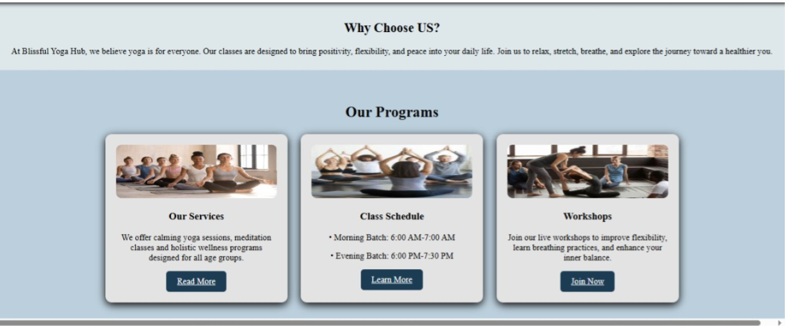
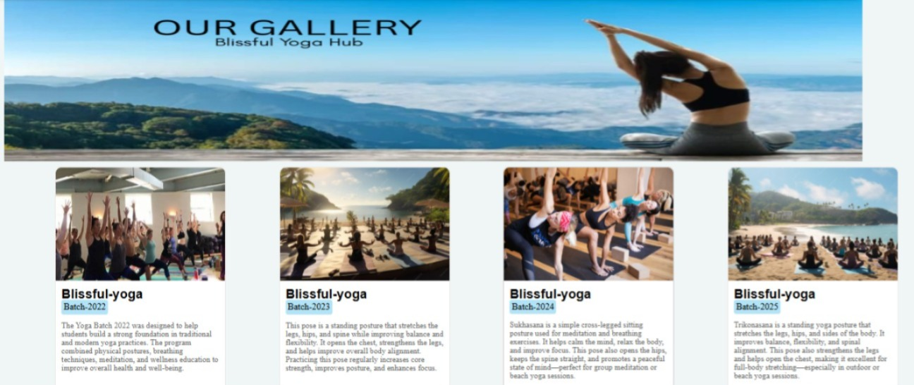

# <u>Blissful Yoga Hub</u>

## Welocome to Blissful Yoga Hub:
Yoga is an ancient Indian practice that involves a holistic system of physical postures (asanas), breathing techniques (pranayama), and meditation to achieve a state of harmony between the mind and body. The word "yoga" comes from the Sanskrit root "yuj," meaning "to join," and the practice aims to bring the individual consciousness into union with the universal consciousness. Modern yoga often emphasizes the physical and mental health benefits, such as increased flexibility, strength, and stress relief. 

---
## About us:

### Why Choose US?
At Blissful Yoga Hub, we believe yoga is for everyone.
Our classes are designed to bring positivity, flexibility, and peace into your daily life.                                                    Join us to relax, stretch, breathe, and explore the journey.

## Types of Yoga

## Benefits:

## Gallery: 

## <u>Join Now</u>

---
Your sanctuary for peace, balance, and holistic well-being.
We offer yoga, meditation, wellness workshops and healing sessions for all age groups.